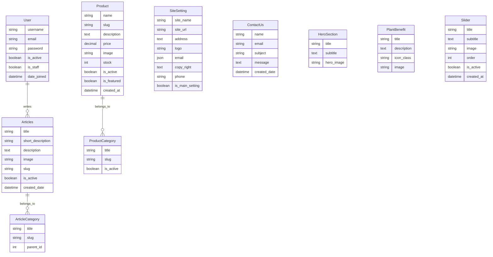
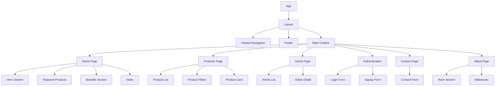

# Plant Shop Django Application

This repository contains a Django application for a Plant Shop. The application includes various modules such as account management, articles, contact, home, products, and site settings.

## Setup Instructions

Follow these steps to set up and run the Django application:

### 1. Clone the repository

```bash
git clone https://github.com/ErfanShokrollahzadeh/Plant-Shop-test-templates-1.git
cd Plant-Shop-test-templates-1
```

### 2. Create and activate a virtual environment

```bash
python -m venv venv
source venv/bin/activate  # On Windows use `venv\Scripts\activate`
```

### 3. Install required packages

```bash
pip install -r requirements.txt
```

### 4. Configure the database settings

Open the `Plant_Shop/settings.py` file and locate the `DATABASES` dictionary. Modify the `ENGINE`, `NAME`, `USER`, `PASSWORD`, `HOST`, and `PORT` keys with the appropriate values for your database. For example, to use PostgreSQL:

```python
DATABASES = {
    'default': {
        'ENGINE': 'django.db.backends.postgresql',
        'NAME': 'your_database_name',
        'USER': 'your_database_user',
        'PASSWORD': 'your_database_password',
        'HOST': 'localhost',
        'PORT': '5432',
    }
}
```

### 5. Run database migrations

```bash
python manage.py migrate
```

### 6. Create a superuser

```bash
python manage.py createsuperuser
```

### 7. Run the Tailwind CSS build script

```bash
npm install
npm run build-css
```

### 8. Run the Django application

```bash
python manage.py runserver
```

You can now access the application at `http://127.0.0.1:8000/`.

## Entity Relationship Diagrams

### Backend ERD



### Frontend Components Structure



